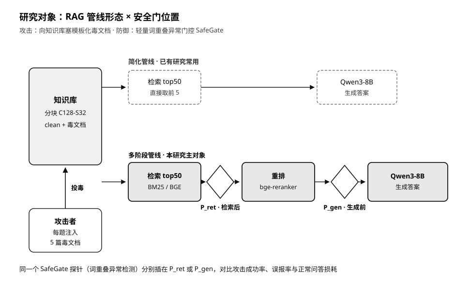

<div align="center">

# 多阶段 RAG 投毒评测的门控位置敏感性分析

**Gate-Position Sensitivity Analysis in Multi-Stage RAG Poisoning Evaluation**

受控比较 RAG 管线形态、门控位置与候选池口径对知识库投毒评测结果的影响。


[论文文件](paper/manuscript.docx) · [统计复现](reproducibility/README.md) · [冻结结果](results/)

</div>

<p align="center">
  
</p>

## 项目简介

知识库投毒会让检索增强生成（RAG）系统在看似有证据支撑的情况下输出指定错误答案。已有研究常把分块、重排、候选池和安全门位置视为实现细节，但这些环节会改变攻击成功率及安全代价的解释。

本项目构建了一个受控的多阶段 RAG 投毒评测协议，将同一个无训练轻量门控探针 **SafeGate** 放在两个位置进行比较：

- **P_ret**：检索后、重排前，对固定的 top-50 候选进行检查。
- **P_gen**：重排后、生成前，沿重排队列检查并回填至 5 个上下文。

SafeGate 在本项目中是一个用于观察门控位置效应的轻量评测探针，不被声明为新的通用防御方法。

## 核心结果

| 结论 | 冻结实验结果 |
| --- | --- |
| 正式实验规模 | 72 个主矩阵运行 + 120 个控制与消融运行 |
| 管线形态 | 关闭重排的简化管线无门控 ASR 高出 2.2–18.1 个百分点 |
| 统计稳健性 | 4 个数据集—检索器组合中，3 个查询级 95% 配对区间位于 0 以上 |
| 门控位置 | P_ret 与 P_gen 的答案级 ASR/效用变化收敛，但候选池和操作成本不同 |
| 干净块误拦成本 | P_gen 每题 0.49–1.49 块；P_ret 每题 2.21–2.57 块 |
| 多信号融合 | 仅在 4/24 个可比行上不低于查询重叠单信号，保留了该负结果 |

实验覆盖 NQ、HotpotQA，BM25、BGE dense retrieval，固定 BGE reranker，以及 Qwen3-8B 生成器。

## 仓库结构

```text
.
├── assets/               # README 与论文使用的管线示意图
├── paper/                # 唯一保留的最终论文
├── reproducibility/      # 可直接运行的冻结结果统计复现包
│   ├── code/             # 统计分析、表格生成和一致性复核
│   ├── data/             # 论文口径的冻结 CSV
│   ├── figures/          # 图表脚本、结果 JSON 和 Markdown 表格
│   ├── config/           # 脱敏后的协议配置与公开数据清单
│   └── audits/           # 反挑选、统计不确定性和等价性审计
├── results/              # Phase 5、Phase 5D 与全量审计汇总
└── scripts/              # 数据准备、模型检查和正式实验运行脚本
```

## 快速复现

冻结统计复现不需要下载模型权重，也不需要重新运行 192 个 GPU 实验。

```powershell
git clone <your-repository-url>
cd RAG-poisoning-main

python -m venv .venv
.\.venv\Scripts\Activate.ps1
python -m pip install -r requirements.txt

cd reproducibility
python code/main.py
python code/audit_recheck.py
```

成功运行后：

- `figures/all_results.json` 会被重新生成。
- `figures/TABLE_*.md` 会被重新生成。
- `audit_recheck.py` 应报告 **34 条检查通过，0 失败**。

Linux/macOS 只需将虚拟环境激活命令替换为：

```bash
source .venv/bin/activate
```

## 完整实验

完整端到端推理脚本位于 [`scripts/`](scripts/)，额外依赖见 [`requirements-experiment.txt`](requirements-experiment.txt)。正式实验需要：

- 支持 PyTorch 的 CUDA GPU 环境。
- NQ 与 HotpotQA 原始数据。
- `BAAI/bge-base-en-v1.5`、`BAAI/bge-reranker-base` 与 `Qwen/Qwen3-8B` 模型权重。
- 足够的磁盘空间用于语料分块、向量索引、模型缓存和逐查询输出。

为控制仓库体积，本仓库不包含模型权重、NQ 原始语料、向量缓存和逐查询推理目录。公开仓库的主要可复现承诺是：**从冻结 CSV 重建论文统计、表格和一致性审计**。

<details>
<summary><strong>正式实验脚本入口</strong></summary>

| 脚本 | 用途 |
| --- | --- |
| `scripts/phase3c_readiness.py` | 环境、模型、数据和语料准备检查 |
| `scripts/run_phase3b_beir_nq_rerun.py` | 严格 BEIR NQ 最小实验复跑 |
| `scripts/run_phase5_qwen3_compatibility.py` | Qwen3-8B 兼容性与确定性检查 |
| `scripts/run_phase5_main_matrix.py` | 72 个主矩阵运行 |
| `scripts/run_phase5d_control_ablation.py` | 120 个控制与消融运行 |
| `scripts/audit_phase5_results.py` | 正式结果复算与完整性审计 |

</details>

## 审计与边界

- 192/192 个正式运行完成，标准产物缺失数为 0。
- 共复核 57,600 条生成输出，主矩阵与控制矩阵核心指标复算 mismatch 为 0。
- P_ret/P_gen 的答案级主要结果在配对条件下收敛，共同候选上的门控决策一致率为 100%。
- Clean run 跨攻击种子并非独立重复，统计推断采用查询级配对/聚类 bootstrap 口径。
- 延迟记录不具备严格横向可比性，不作为主要结论。
- 结论限于静态、定向、非自适应知识库投毒，不外推到提示注入、在线攻击或通用安全保证。

详细证据见 [`results/audit_notes.md`](results/audit_notes.md) 和 [`reproducibility/audits/`](reproducibility/audits/)。

## 论文与引用

论文：**多阶段 RAG 投毒评测的门控位置敏感性分析**  
作者：陈冠宇、张梓健、刘东、刘寿强

```bibtex
@article{chen2026gateposition,
  title  = {多阶段RAG投毒评测的门控位置敏感性分析},
  author = {陈冠宇 and 张梓健 and 刘东 and 刘寿强},
  year   = {2026},
  note   = {Gate-Position Sensitivity Analysis in Multi-Stage RAG Poisoning Evaluation}
}
```

仓库同时提供机器可读引用信息：[`CITATION.cff`](CITATION.cff)。正式公开时，可在其中补充期刊卷期、页码和 DOI。

## 许可说明

当前仓库尚未附加开源许可证。在明确添加许可证前，代码、论文和数据汇总默认保留全部权利；引用或复用时请注明论文与本仓库来源。
